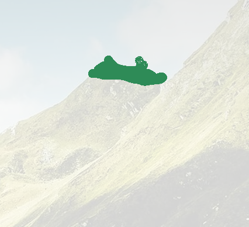
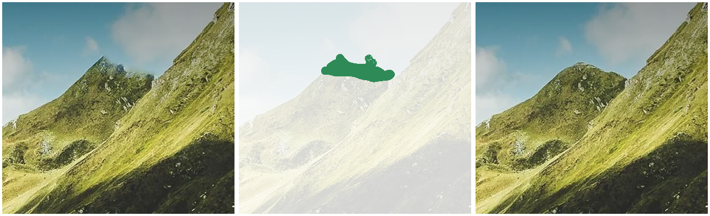

+++
title = "Using ImageMagick to visually diff images"
date = "2022-11-17"

[taxonomies]
categories=["unix"]
tags=["imagemagick"]
+++

ImageMagick is a well-known CLI tool that provides image processing capabilities. It can handle hundreds of different
image formats and gives you a programmatic interface to create, edit, compose, and convert images. I personally use the
`convert` command very often to resize an image (e.g., `convert -resize 300x300 -quality 100 source.png out.png`) or
convert between different formats. ImageMagick also has a lesser known the ability to visually diff images, using its
`compare` & `montage` commands.

<!-- more -->

Looking at the `man` pages of the commands, we find these descriptions:

-   `compare(1)` - mathematically and visually annotate the difference between an image and its reconstruction.
-   `convert(1)` - convert between image formats as well as resize an image, blur, crop, despeckle, dither, draw on,
    flip, join, re-sample, and much more.
-   `montage(1)` - create a composite image by combining several separate images. The images are tiled on the composite
    image optionally adorned with a border, frame, image name, and more.

To illustrate a simple use case, we'll use `compare` to produce a visual representation of the differences between the
following images. We'll then use `montage` to create a single image containing both the original images and the visual
difference.

<div style="display: grid; grid-template-columns: 1fr 1fr; grid-gap: 16px;">
    
    
</div>

-----

## Comparing images

We'll use the `compare` command to visually annotate differences between two input images. This command takes a
`-highlight-color` option which controls the color to use for annotating the differences (I prefer `seagreen`). We'll
use the defaults for the rest (do check the man page, there are tons of configuration options). Let's compare the two
images and save the output to a png file called `compare.png`:

```sh
compare 2.png 1.png -highlight-color seagreen png:compare.png
```

<p>
    
</p>

## Combining it all

We now have three separate image files, the two original images and the visual diff. Let's combine them into one for
convenience! The `montage` command allows us to do this - we'll use it to lay out the three images next to each other in
the provided order:

```sh
montage -geometry +4+4 2.png compare.png 1.png png:montage.png
```

<p>
    
</p>

## Leveraging stdout & stdin

ImageMagick provides great support for pipes. We can use this to reduce the above commands into one, and in doing so we
also avoid having to create intermediary files (`-` as a filename represents stdout/stdin, per common conventions):

```
compare 2.png 1.png -highlight-color seagreen png:- | montage -geometry +4+4 2.png - 1.png png:-
```

## Conclusion

ImageMagick is a powerful tool with capabilities that exceed most people's expectations. Use it to automate image
processing tasks! The following is a script that I use for simple comparisons (to use it: name it something cool, `chmod
+x` it, and put it somewhere in your `PATH`).

```sh
#!/usr/bin/env bash

if [ -t 1 ]; then
    >&2 echo "Refusing to diff image in terminal without redirecting stdout."
    exit 1
fi

if [[ $1 == "-grayscale" ]]; then
    shift 1
    convert '(' "$2" -flatten -grayscale Rec709Luminance ')' \
        '(' "$1" -flatten -grayscale Rec709Luminance ')' \
        '(' -clone 0-1 -compose darken -composite ')' \
        -channel RGB -combine png:-;
else
    compare "$2" "$1" -highlight-color seagreen png:- | montage -geometry +4+4 "$2" - "$1" png:-;
fi
```
